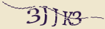

# Captcha integration for the Laravel 9 and bellow
Package information:

## Installing Laravel Captcha Composer Package
Note: If you do not have Composer yet, you can install it by following the instructions on https://getcomposer.org
#### Step 1. Install package
```bash
composer require karim007/laravel-captcha
```
#### Step 2 for Laravel 5.5 and below. Register the Laravel Captcha service provider
{LARAVEL_ROOT}/config/app.php:
```php
'providers' => [
    ...
    Karim007\LaravelCaptcha\CaptchaServiceProvider::class,
],
```

## Examples





For  video tutorial click the image bellow or https://youtu.be/9egTxTg6dkw

[](https://youtu.be/9egTxTg6dkw)

## Using Laravel Captcha

Add this in your blade file
```html
...
@captcha
<input type="text" id="captcha" required name="captcha">
 ...
```
For validation add this in your controller
```php
<?php

class CaptchaController extends Controller
{
    public function myfunction(Request $request)
    {
    	$this->validate($request, [
            'captcha' => 'required|captcha'
        ]);

        // Validation passed
    }
}
```
### for publishing your config file named captcha.php
```bash
php artisan vendor:publish --provider="Karim007\LaravelCaptcha\CaptchaServiceProvider" --tag="config"
```
```php
<?php

return [

/*
    |--------------------------------------------------------------------------
    | Captcha middleware
    |--------------------------------------------------------------------------
    |
    */
    'middleware' => ['web'],

    /*
    |--------------------------------------------------------------------------
    | Captcha routes
    |--------------------------------------------------------------------------
    |
    */
    'routes' => [
        'image'     => 'captcha/image',
        'image_tag' => 'captcha/image_tag'
    ],

    /*
    |--------------------------------------------------------------------------
    | Blade directive
    |--------------------------------------------------------------------------
    | You can use blade directive @captcha for rendering captcha.
    |
    */
    'blade' => 'captcha',

    /*
    |--------------------------------------------------------------------------
    | Validator name
    |--------------------------------------------------------------------------
    |
    */
    'validator' => 'captcha',

    /*
    |--------------------------------------------------------------------------
    | Captcha generator.
    |--------------------------------------------------------------------------
    | Must implement GeneratorInterface.
    |
    */
    'generator' => \Karim007\LaravelCaptcha\Captcha\Generator\GeneratorWaves::class,

    /*
    |--------------------------------------------------------------------------
    | Storage code.
    |--------------------------------------------------------------------------
    | Must implement StorageInterface.
    |
    */
    'storage' => \Karim007\LaravelCaptcha\Captcha\Storage\SessionStorage::class,

    /*
    |--------------------------------------------------------------------------
    | Code generator.
    |--------------------------------------------------------------------------
    | Must implement CodeInterface.
    |
    */
    'code' => \Karim007\LaravelCaptcha\Captcha\Code\SimpleCode::class,

    /*
    |--------------------------------------------------------------------------
    | Font
    |--------------------------------------------------------------------------
    | Supported: "IndiraK".
    |
    */
    'font' => base_path('vendor/karim007/laravel-captcha/src/resources/fonts/IndiraK.ttf'),

    /*
    |--------------------------------------------------------------------------
    | Font size
    |--------------------------------------------------------------------------
    | Font size in pixels.
    |
    */
    'fontSize' => 26,

    /*
    |--------------------------------------------------------------------------
    | Letter spacing
    |--------------------------------------------------------------------------
    | Spacing between letters in pixels.
    |
    */
    'letterSpacing' => 2,

    /*
    |--------------------------------------------------------------------------
    | Code Length
    |--------------------------------------------------------------------------
    | You can specify an array or integer.
    |
    */
    'length' => [4, 5],

    /*
    |--------------------------------------------------------------------------
    | Displayed chars
    |--------------------------------------------------------------------------
    | Enter the different characters.
    |
    */
    'chars' => 'QSFHTRPAJKLMZXCVBNabdefhxktyzj23456789',

    /*
    |--------------------------------------------------------------------------
    | Image Size
    |--------------------------------------------------------------------------
    | Captcha image size can be controlled by setting the width
    | and height properties.
    |
    |
    */
    'width'  => 180,
    'height' => 50,

    /*
    |--------------------------------------------------------------------------
    | Background Captcha
    |--------------------------------------------------------------------------
    | You can specify an array or string.
    |
    */
    'background' => 'f2f2f2',

    /*
    |--------------------------------------------------------------------------
    | Colors characters
    |--------------------------------------------------------------------------
    | You can specify an array or string.
    |
    */
    'colors' => '2980b9',

    /*
    |--------------------------------------------------------------------------
    | Scratches
    |--------------------------------------------------------------------------
    | The number of scratches displayed in the Captcha.
    |
    */
    'scratches' => [1, 6],

    /*
    |--------------------------------------------------------------------------
    | Id of the Captcha code input textbox
    |--------------------------------------------------------------------------
    | After updating the Captcha focus will be set on an element with this id.
    |
    */
    'inputId' => 'captcha',

];
```
### Localization
Supported languages:
* Arabic
* Chinese
* Dutch
* English
* Japanese
* Korean
* French
* German
* Spanish
* Turkish
* Ukrainian
* Hindi
* Italian
* Persian
* Portuguese
* Russian

Publish lang info
```bash
php artisan vendor:publish --provider="Karim007\LaravelCaptcha\CaptchaServiceProvider" --tag="lang"
```

publish views files
```bash
php artisan vendor:publish --provider="Karim007\LaravelCaptcha\CaptchaServiceProvider" --tag="views"
```

Contributions to the Captcha package you are welcome. Please note the following guidelines before submitting your pull
request.

- Follow [PSR-4](http://www.php-fig.org/psr/psr-4/) coding standards.

## License

This repository is licensed under the [MIT License](http://opensource.org/licenses/MIT).

Copyright 2022 [md abdul karim](https://github.com/karim-007)
